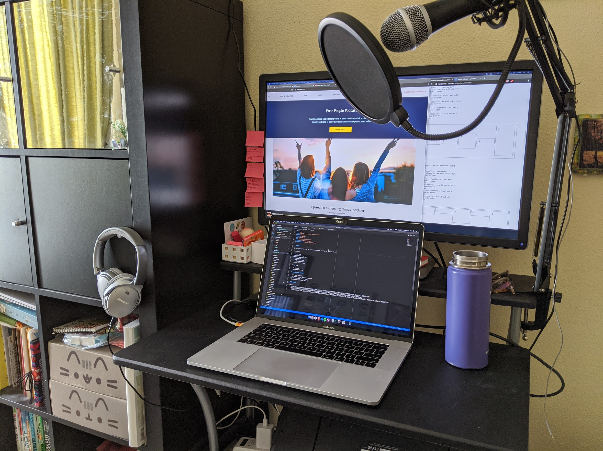
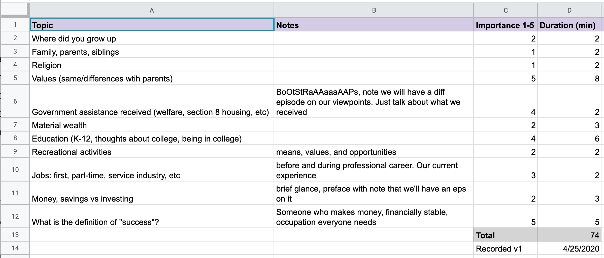
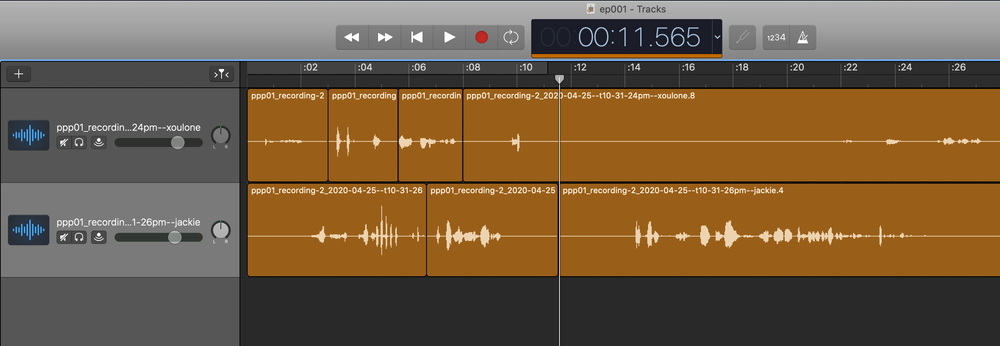

Yes, that is my teeny workstation. I don't have much space for myself in my home. Unlike Jackie, I didn't have proper recording equipment, so I had to purchase a mic, boom arm, pop filter, and a stabilizer. Fortunately, it arrived the day before, and I was able to set it up in time for today's session!

# Logistics

We did more supplemental planning yesterday! We wrote out assignments and then actually did some recording. We're unsure yet if this is going make up the majority of our first episode, or if we were too awkward and need to practice more. But in general, I think it was an excellent practice run, and we found out what tools and apps to use.

## Assignments

- Website, [Gatsby + Netlify](https://www.netlify.com/with/gatsby) (Mee)
- Audio Editing, [Garage band](https://www.apple.com/mac/garageband/) (Mee)
- Social/copy person (Jackie). In charge of writing [newletters](https://mailchimp.com) and other social media posts
- [Podcast publishing](https://anchor.fm) coordination (Jackie)
- Topics and content (shared effort)

## Action items

- Write bio (Jackie)
- Purchase domain (Mee). Unsure of timing, but something to keep in mind

## Quotes out of context

- Don't cause suffering
- The path to success is higher education
- It filled me with so much shame
- Sometimes I still think about it

## Other Resources

- Sound: I went to go find some free/royalty-free sound and music and stumbled upon the [Free Music Archive](https://freemusicarchive.org) and found an excellent minimal, sort of goofy soundtrack to use as a candidate. [Blue Dot Sessions - Cupcake Marshall](https://files.freemusicarchive.org/storage-freemusicarchive-org/music/Music_for_Video/Blue_Dot_Sessions/Love_and_Weasel/Blue_Dot_Sessions_-_04_-_Cupcake_Marshall.mp3)
- Recording: To record remotely, have separate tracks for ease of editing, and for decent quality, we found [Zencastr](https://zencastr.com/). It is free right now!

# Behind the scenes

A couple weeks ago, we did some thorough planning for our first episode. We listed our subtopics and estimated how much time (virtually effort) we want to put into each. Here's what that looked like in google sheets. The goal wasn't to be strict, but to provide a ballpark and have an understanding of where our energy was being used.

I also worked a couple hours listening to and editing our recording session. A lot of surgury had to be done near the beginning because we were warming up.

I never used Garage Band before, but I heard it was really easy to pick up to do simple things. I will have to agree! I had no problem adding in different tracks, sound, editing/cutting, and adjusting sound levels.
