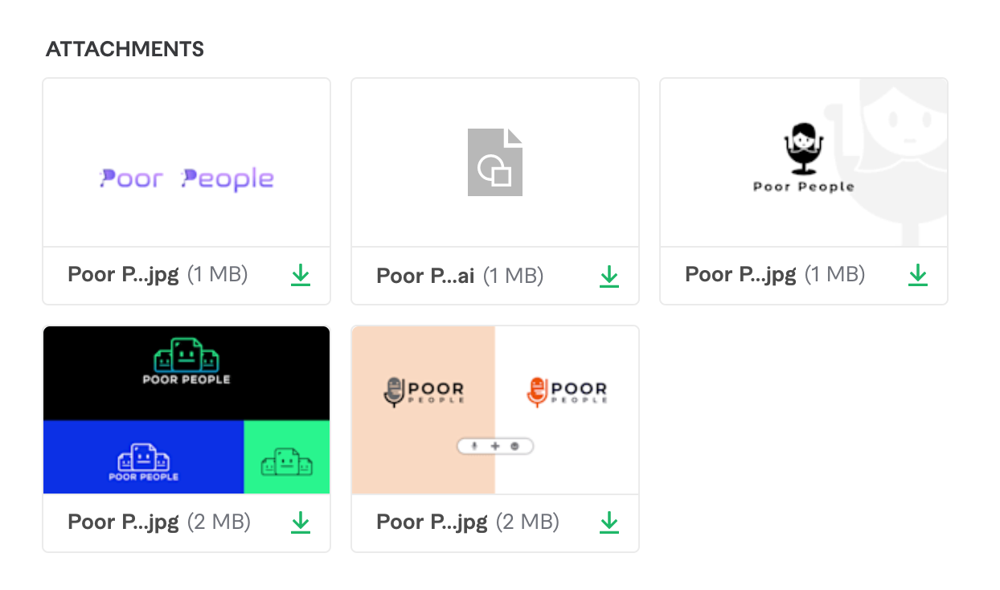
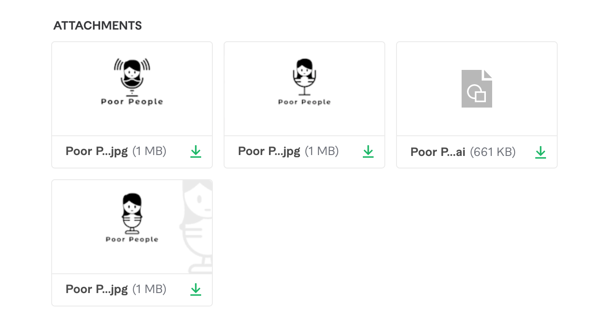
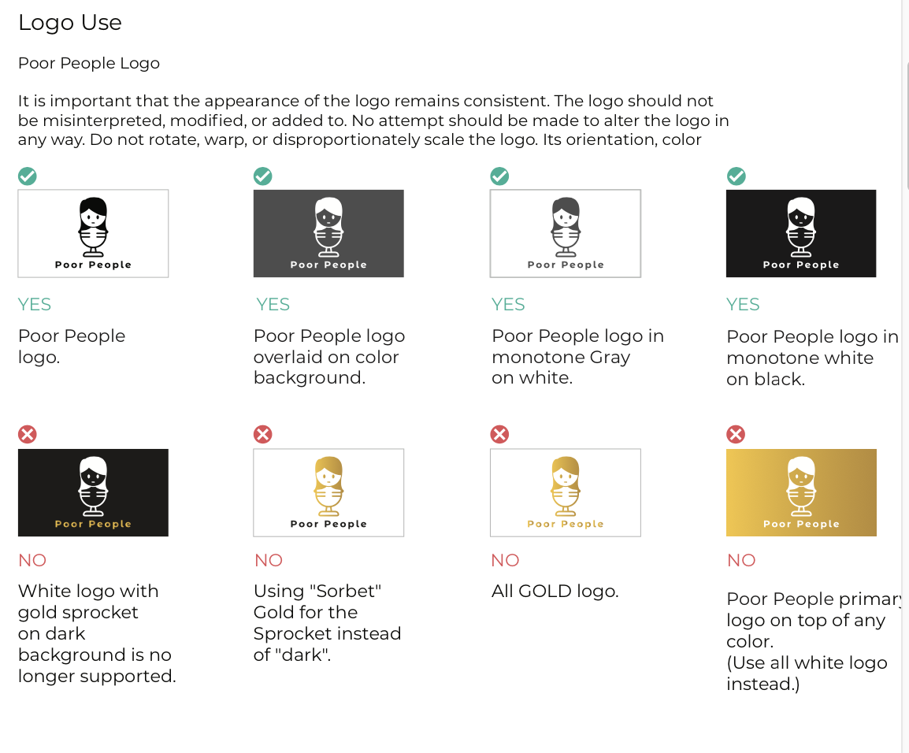

I finally decided to work on getting a nicer logo. One of the podcast's goal was to spend as little money as possible since it was supposed to be for entertainment purposes and be stress-free. Also, I think money complicates things, some of them revolving around desire and motivation.

Additionally, I know I'm not a designer and neither is Jackie. We want to pay someone who knows what they are doing to do this thing for us.

Pay for the thing!

But I thought spending a couple of bucks for a tidier logo seemed fair. We honestly haven't had much branding done, except for our initial OH CRAP WE NEED A LOGO and shoved some free SVGs together. The current color palette mostly came from a free design too.

You can say there wasn't much professional work behind it and we're going to get better. Again, I emphasize Poor People is a passion project. Besides the podcast recording itself, there are tons of new experiences involved in the whole ordeal.

For example, this was the first time I hired a designer to make something for me! I ran several iterations over at [Fiverr](https://www.fiverr.com/) with one designer and had an excellent experience. The gentleman was extremely responsive and sent over four different design concepts within 24 hours.

I then provided feedback on all of them and continued to iterate two more times with just our favorite flavor.

And then we landed with what you see now. We had concerns about the logo looking like a head stuck in a wine glass. My boyfriend said the current one looks like a head on a weird body and it freaks him out, but another friend said it looked like a girl on a mic.

_S H R U G_

We will run with this for now!

We also got a 13 page brand guide as a part of the package that comes with standard logo usage, a color palette, some icons, typography...etc. But to be honest, all I wanted was the logo. A lot of the stuff I got was pretty basic and standard. I attribute it to the budget price I paid, and I am 100% okay with it.

I might work on integrating the colors at a later point. Most of the delivered assets were heavily inspired by our website because it was a resource I gave the designer for a direction. I gave him barely anything, to be honest, but happy with the results.

I highly recommend you get a simple design over there if you're unsure about expenses and need something quick. Or, if you have a higher budget, there are fantastic designers on that platform (and others) as well. The internet is an excellent resource for creativity and building your brand!
