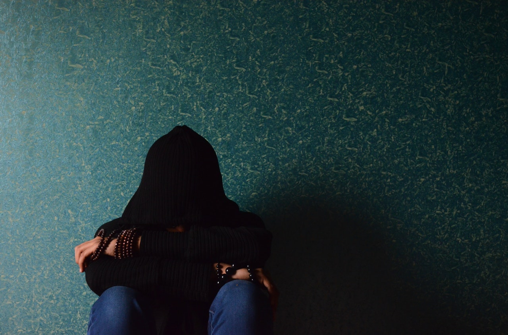
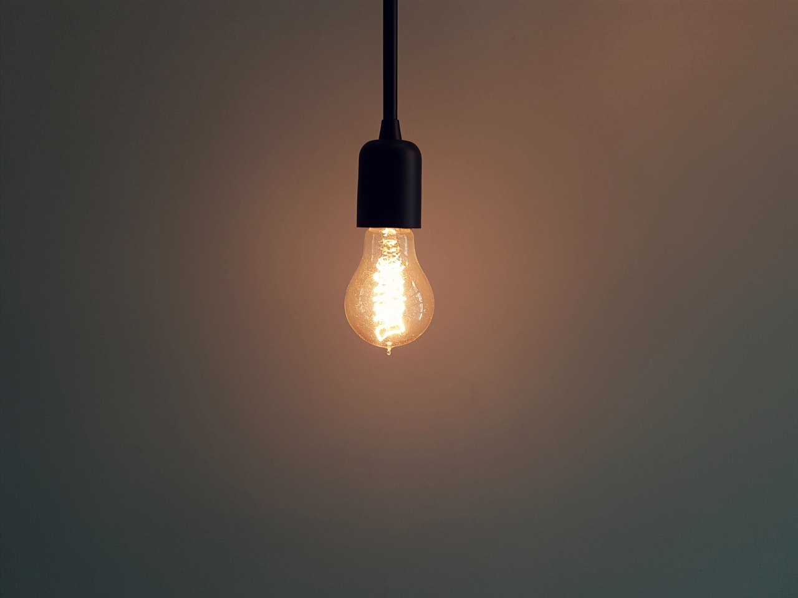
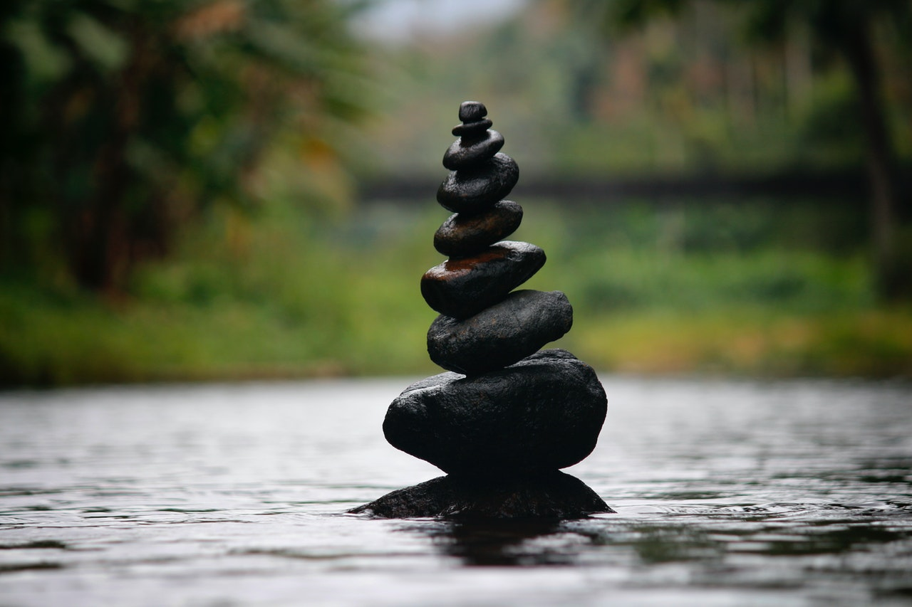

The concept sparked during a passionate discussion about the failing United States economy and lack of economic and health safety nets during the COVID19 crisis. Jackie and Mee have been sharing angry political and economic dialog for years and have finally had _enough_. The more they talked, the more they realized they had similar backgrounds and were bouncing many of the same thoughts off each other.

Whether that was a coincidence or not, they believed it would be beneficial to share their conversations and also broaden it with those of differing views and upbringing.

## Vision

Too many times do we see our Asian-American household families and friends (plus other underprivileged families) worry about classic "traditional" problems, and fail to see some major issues in the long run. Number one is financial stability. We believe it is essential to share our experiences and thoughts with the community to provide beneficial insight that may have previously been foreign.

Poor People is a passion project inspired by our underprivileged backgrounds in an attempt to give back to those who need it most: our past selves.

What does it mean to be successful? What is the balance between old traditions and new? Do your views differ from your parents? How do you find the balance between the two? Are you exhausted?

Our conversations attempt to extract and discuss a lot of these questions that haunted us as kids and the new ones we tackle as first and second-generation Asian American adults.

    <h2>Values</h2>
    <ul>
        <li>Provide progressive conversations and views in today's economic environment</li>
        <li>Challenge traditional views imposed on us by our immigrant roots by disrupting the status quo and tearing down barriers we face</li>
        <li>Build a safe space for people to share their experience and voices</li>
    </ul>

## Audience

The information and discussions are open to anyone of any social-economic background, race, and ethnicity. Even if we discuss our topics with a POC point of view, we attempt to keep dialog and solutions as thoughtful as possible.

## The Name

The "Poor People" name has two meanings:

- a sentiment to how both our families got by with very little
- a reflection of our former selves lacking knowledge that would have proven helpful as adults

We joke by saying "poor young Mee and Jackie didn't know better". Hopefully we know better now, or know which questions to ask and where to search for answers!

## Credits and Resources

Our podcast is hosted at [Anchor](https://anchor.fm/poorpeople).

Most stock image and assets are from various artists on [Pexels](https://pexels.com) and will be given proper credit.

- Alone and Frustrated by [Pixabay](https://www.pexels.com/@pixabay)
- Pendant light by [Burak K](https://www.pexels.com/@weekendplayer)
- Balanced rocks by [Nandhu Kumar](https://www.pexels.com/@nandhukumar)
